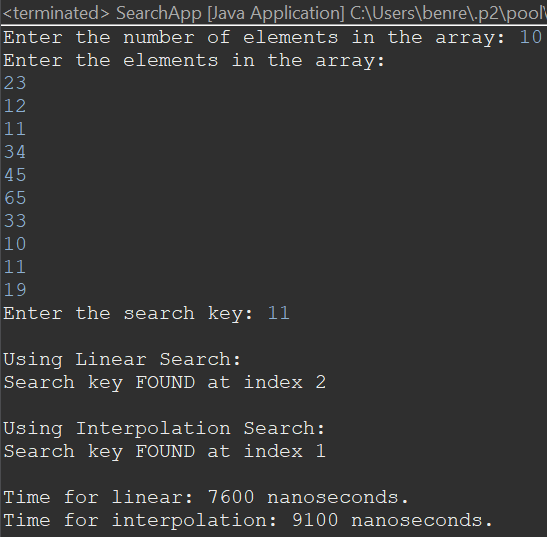

# Question 1:
See 'SearchApp.java' for implementation of lab

Both the methods are implemented

# Question 2:
Linear is faster since it is better with smaller data sets as the calculation isn't as time consuming, and in the provided example values the key was near the beginning of the array. 

The provided example values ran at 7600 nanoseconds for linear and 9100 nanoseconds for interpolation.

# Question 3:
To improve the linear search running time redundant lines were removed so each iteration had less steps to complete.